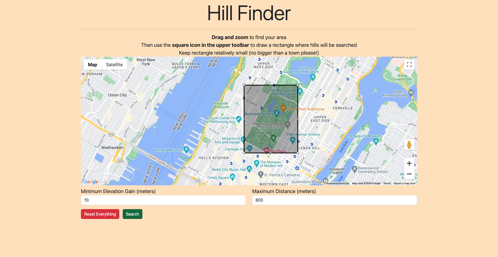
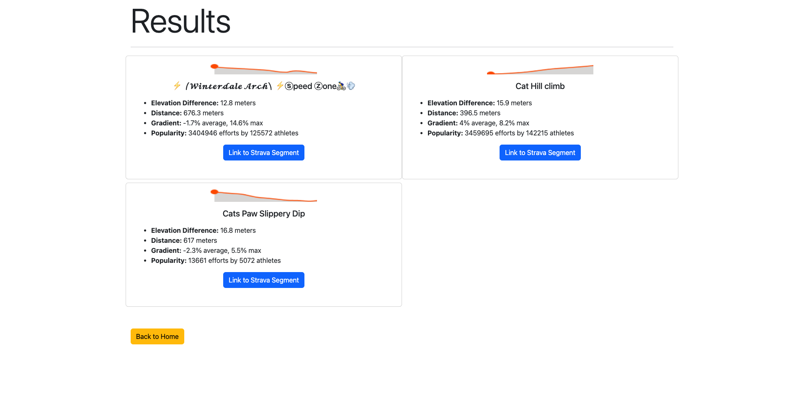

# hillFinder

> *A web app for finding hills to run/bike on.*

---

## Link

This project is deployed using AWS Elastic Beanstalk at this [link](http://hillfinder-env-3.eba-9udekxwn.us-east-1.elasticbeanstalk.com/).

## Usage Example

Searching for hills with at least 10 meters in elevation gain in Central Park. 

Results provide an elevation profile and other hill metrics for each segment.

The [Strava](https://www.strava.com/) links can be used to obtain detailed location information.

## Support

Encounter an issue?

If you find a bug or have a feature request, please file an issue or email me at timliang4@gmail.com. Or, if you'd like to contribute, feel free to submit a pull request.
